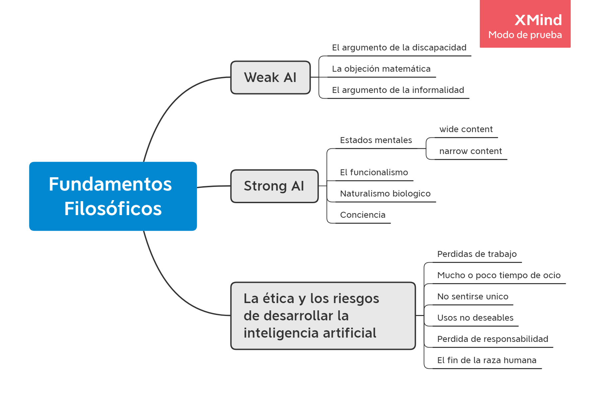

#Fundamentos Filósofos

Hay dos hipotesis usadas por los filósofos llamadas **weak AI** y **strong AI**. La creencia de que las maquinas podrían actuar como si fueran inteligentes se llama weak AI y la creencia de que las maquinas piensan (no solo que simulen el pensamiento) se llama strong AI.

# Weak AI

Los filósofos están interesados en el problema de comparar al humano con la maquina, llegando a preguntarse si las *maquinas pueden pensar*.

Alan Turing, en su paper *"Computing Machinery and Intelligence"*, sugirió que en vez de preguntarse si las maquinas pueden pensar deberiamos preguntarnos si las maquinas pueden pasar una *prueba de inteligencia conductual*, la cual se llamo **Test de Turing**.

El propio Turing examinó una amplia variedad de posibles objeciones a la posibilidad de máquinas inteligentes, incluidas prácticamente todas las que se han planteado en el medio siglo desde que apareció su artículo. Se verán algunas de ellas.

### El argumento de la discapacidad 

El **argumento de la discapacidad** afirma que *"una maquina nunca puede hacer X"*. Como ejemplos de X, Turing lista algunas de las siguientes:

*Ser amable, ingeniosa, hermosa, amigable, tener iniciativa, tener sentido del humor, distinguir el bien del mal, equivocarse, enamorarse, disfrutar frutillas con crema, hacer que alguien se enamore de ella, aprender de la experiencia, uras palabras apropiadamente, ser el protagonista de sus pensamientos, hacer algo realmente nuevo, tener tanta diversidad de comportamiento como el hombre.*

 

Pero las computadoras funcionan a nivel humano en tareas que aparentemente involucran el juicio humano, o como Turing le llama, "aprender de la experiencia" y la habilidad para "distingui el bien del mal".

Esta claro que las computadoras pueden hacer muchas cosas tan bien o incluso mejor que los humanos, incluyendo cosas que las personas creen que requieren gran perspicacia y comprension humana. Esto no quiere decir que las computadoras poseen perspicacia o comprension humana para hacer dichas tareas, si no que realizan procesos que "simulan" esta comprension. Por otro lado, las computadoras tienen problemas al realizar otras tareas, como mantener una converzacion abierta. 

### La objecion matematica

Se sabe, por el trabajo de Turing y Godel, que ciertas cuestiones matemáticas son, en principio, incontestables mediante un sistema formal particular. Pero también se sabe que una computadora se desenvuelve mejor que un ser humano en muchas otras. Ningún humano podría realizar la suma de 10 billones de números en su tiempo de vida, sin embargo una computadora lo puede hacer en segundos.

Finalmente, incluso si admitimos que las computadoras tienen limitaciones sobre lo que pueden probar, no hay evidencia de que los humanos sean inmunes a esas limitaciones. 

### El argumento de la informalidad 

El **argumento de la informalidad** afirma que el comportamiento humano es demasiado complejo como para ser capturado por cualquier conjunto de reglas simples y, como las computadoras no hacen mas que seguir un conjunto de reglas, no pueden generar comportamiento tan inteligente como el de los humanos. La incapacidad de capturar todo en un conjunto de reglas lógicas se llama **qualification problem** en IA.

Ciertamente es cierto que muchos procesos de pensamiento se realizan a un nivel que no está abierto a la introspección por parte de la mente consciente. Pero esto no significa que los procesos de pensamiento no existen. 

# Strong AI

Muchos filósofos han afirmado que una máquina que pasa el Test de Turing no estaría pensando en realidad, sino que sería solo una simulación del pensamiento. Una vez más, la objeción fue prevista por Turing. El cita:

*"Hasta que una máquina no pueda escribir un soneto o componer un concierto debido a los pensamientos y las emociones sentidas, y no por la caída casual de los símbolos, no podríamos estar de acuerdo en que la máquina es igual al cerebro. Es decir, no solo escribirlo sino saber que lo había escrito."*

Turing llama a esto el **argumento de la conciencia**, que dice que las maquinas tienen que ser conscientes de sus propios estados y acciones mentales*.

Otros se centran en la **intencionalidad**, es decir, la cuestión de si las supuestas creencias, deseos y otras representaciones de las máquinas son en realidad "sobre" algo en el mundo real.

Uno debe insistir en que hay una cuestion de hecho en juego: los humanos tienen mentes reales, y las maquinas podrian o no podrian tenerlas. Para tratar esto necesitamos entender cómo es que los humanos tienen mentes reales, no solo cuerpos que generan procesos neurofisiológicos.

La teoría monista de la mente, a menudo llamada fisicalismo, evita este problema afirmando que la mente no esta separada del cuerpo y que los estados mentales son estados fisicos. El problema para los fisicalistas se encuentra en explicar como estados fisicos pueden ser simultaneamente estados mentales.

### Estados mentales
 
Si el fisicalismo es correcto, debe darse el caso de que la descripción adecuada del estado mental de una persona esté determinada por el estado cerebral de esa persona.

El contenido de los estados mentales puede ser interpretado desde dos puntos de vista diferentes: **wide content** y **narrow content**. El primero afirma que el contenido involucra tanto el estado cerebral como el historial ambiental. El segundo considera solo el estado mental.   

### El funcionalismo

La teoría del funcionalismo dice que un estado mental es cualquier condición causal intermedia entre entrada y salida.

### Naturalismo biologico

El naturalismo biológico afirma que los estados mentales son características emergentes de alto nivel que son causadas por procesos físicos de bajo nivel en las neuronas, y son las propiedades de las neuronas lo que importan. 

### Conciencia

Repasando todos los debates sobre IA fuerte, el problema mas grande que se presenta en debate es la conciencia. 

El mismo Turing admite que la cuestión de la conciencia es difícil, pero niega que tenga mucha relevancia para la práctica de la IA:

*"No quiero dar la impresión de que creo que no hay ningún misterio sobre la conciencia... Pero no creo que estos misterios necesiten ser resueltos antes que podamos responder la pregunta que nos ocupa en este artículo."*

# La etica y los riesgos de desarrollar la inteligencia artificial

Todos los científicos e ingenieros enfrentan consideraciones éticas sobre cómo deben actuar en el trabajo, qué proyectos deben o no deben realizarse y cómo deben manejarse. La IA, sin embargo, parece plantear algunos problemas nuevos más allá de, digamos, construir puentes que no se caigan:

- **La gente podría perder su trabajo debido a la automatización:** Se podría decir que miles de trabajadores han sido desplazados por estos programas de inteligencia artificial, pero de hecho, hasta ahora, la automatización a través de la tecnología de la información en general y la inteligencia artificial en particular ha creado más puestos de trabajo de los que ha eliminado, y ha creado puestos de trabajo más interesantes y mejor pagados.

- **La gente puede tener demasiado (o muy poco) tiempo libre:** Gracias a la IA, podemos tener maquinas trabajando 24, lo cual hace que no sea necesario que una persona realice dicho trabajo. Las personas pueden incluso crear sus propios automatas para hacer tareas que ellos no quieran hacer. Por lo que esto depende finalmente de cada persona.

- **Las personas pueden perder la sensación de ser únicas:** La IA, si tiene un gran éxito, puede ser al menos tan amenazante para los supuestos morales de la sociedad del siglo XXI como la teoría de la evolución de Darwin para los del siglo XIX.

- **Los sistemas de inteligencia artificial pueden usarse para fines indeseables:** “Se dice que una ciencia es útil si su desarrollo tiende a acentuar las desigualdades existentes en la distribución de la riqueza, o más directamente promueve la destrucción de la vida humana”. Esto es válido para todas las ciencias, y la IA no es una excepción.
La tecnología es una herramienta, que puede ser usada tanto para bien como para mal. Hay que controlar su uso. Weizenbaum (1976) también señaló que la tecnología de reconocimiento de voz podría dar lugar a escuchas telefónicas generalizadas y, por lo tanto, a la pérdida de las libertades civiles. No previó un mundo con amenazas terroristas que cambiaría el equilibrio de cuánta vigilancia está dispuesta a aceptar la gente, pero reconoció correctamente que la IA tiene el potencial de producir vigilancia en masa.

- **El uso de sistemas de IA puede resultar en una pérdida de responsabilidad:** La pregunta debería ser "¿Quién tiene la culpa si algo sale mal?" Al igual que con la tecnología de reproducción humana, la ley aún tiene que ponerse al día con los nuevos desarrollos.

- **El éxito de la IA podría significar el fin de la raza humana:** Casi cualquier tecnología tiene el potencial de causar daño en las manos equivocadas. La pregunta es si un sistema de inteligencia artificial presenta un riesgo mayor que el software tradicional.
Dejemos que una máquina ultrainteligente se defina como una máquina que puede superar con creces todas las actividades intelectuales de cualquier hombre, por inteligente que sea. Dado que el diseño de máquinas es una de estas actividades intelectuales, una máquina ultrainteligente podría diseñar máquinas aún mejores; entonces, sin duda, habría una "explosión de inteligencia", y la inteligencia del hombre quedaría muy atrás. Así, la primera máquina ultrainteligente es el último invento que el hombre necesita hacer, siempre que la máquina sea lo suficientemente dócil para decirnos cómo mantenerla bajo control.

# Opinion personal

Creo que no debemos comparar la "inteligencia" de la computadora con la del ser humano. Claramente somos muy distintos. La maquina no tiene "ser", no tiene conciencia, no siente. Pero esto solo la hace distinta, y su forma de pensar también. Pretendemos que una maquina inteligente sea, necesariamente, como un humanoide. Como si nuestra "inteligencia" sea digna de ser copiada.

La maquina nos supera en muchas cosas, al igual que es incapaz de hacer cosas que nosotros podemos hacer fácilmente. Deberiamos buscar explotar ese hecho y que termine siendo la herramienta óptima para nosotros y no necesariamente que sea "como nosotros".

Sin duda la IA vino para quedarse. Estemos o no estemos a favor. Claramente aporta mucho a la sociedad, y muy bueno. Debemos aprender a adaptarla a nuestras necesidades y conveniencias. Por otro lado, un gran poder requiere una gran responsabilidad. Se deben adaptar las leyes para controlar su uso y que el mal uso de la misma no termine opacando todo lo bueno que puede aportar. 

