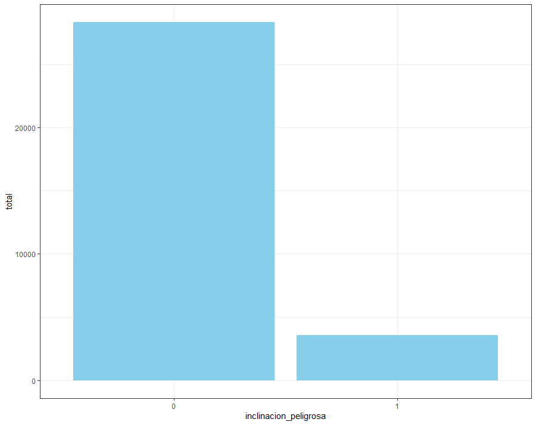
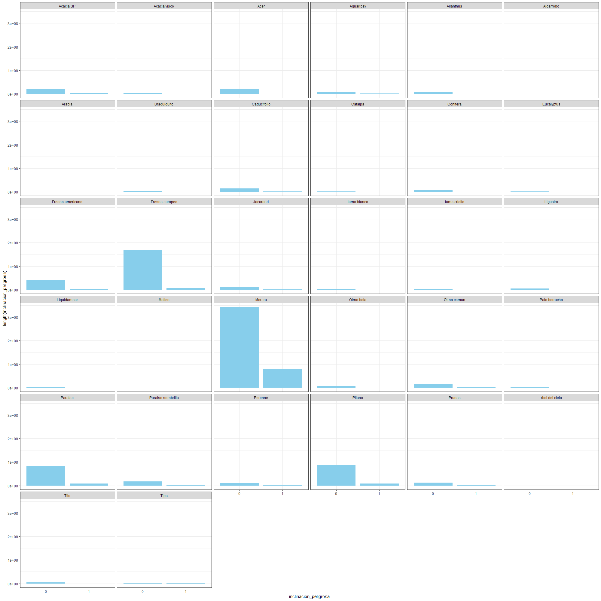

# Parte A

Elimine las variables: ultima modificación, long, lat, nombre sección, área sección y altura

Elimine las variables mencionadas anteriormente. Pase a factor la variable inclinacion_peligrosa.

Aplique Up Samplig al train, entrene con rpart y predije. Esto lo hice 30 veces dada la aleatoriedad del Up Sampling. Obtube un predicción a partir de las 30.

Resultado: 0.68

 

 

# Parte B

+ Arboles de Regresión: Los árboles de regresión son el subtipo de árboles de predicción que se aplica cuando la variable respuesta es continua. En términos generales, en el entrenamiento de un árbol de regresión, las observaciones se van distribuyendo por bifurcaciones (nodos) generando la estructura del árbol hasta alcanzar un nodo terminal. Cuando se quiere predecir una nueva observación, se recorre el árbol acorde al valor de sus predictores hasta alcanzar uno de los nodos terminales. La predicción del árbol es la media de la variable respuesta de las observaciones de entrenamiento que están en ese mismo nodo terminal.

+ Arboles de Clasificación: Los árboles de clasificación son el subtipo de árboles de predicción que se aplica cuando la variable respuesta es categórica.

Algunas técnicas, a menudo llamados métodos conjuntoshíbridos, construyen más de un árbol de decisión:

+ Bagging: Un método de conjunto, construye múltiples árboles de decisión haciendo repetidamente remuestreo de los datos de entrenamiento con sustitución, y votando los árboles para hallar una predicción de consenso.

+ Random Forest: Utiliza una serie de árboles de decisión, con el fin de mejorar la tasa de clasificación.

+ Árboles Impulsados: Se pueden utilizar para problemas de regresión y de clasificación.
​
+ Rotation Forest: Cada árbol de decisión es entrenado aplicando primero análisis de componentes principales (ACP) en un subconjunto aleatorio de las características de entrada.
